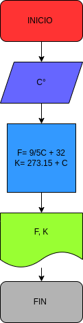

## Ejercicio No° 2:programa para convertir una cantidad de grados C en los equivalentes K y F 

# ANALISIS 

Variable de entrada (imput)

C: grados centigrados

Variable del proceso y salida (processing, storang, output)

F: Grados fahrenheit
K: Grados kelvin 

# DISEÑO

# CONSTRUCCION 